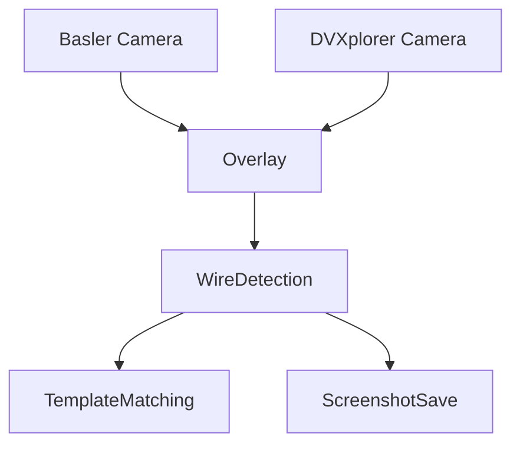

# Project Architecture

## Overview
This project implements a wire detection pipeline using two cameras (Basler and DVXplorer) running in parallel. The system overlays event-based vision data onto frame-based camera data, applies homography for alignment, and detects wire shapes for template matching.

## Components
- **Basler Camera:** Provides grayscale frame images.
- **DVXplorer Camera:** Provides event-based data visualized as images.
- **Overlay:** Combines both camera streams after homography.
- **Wire Detection:** Detects wire contours, fits splines, checks for intersections, and compares to templates.
- **Screenshot/Template Save:** Allows saving overlays and wire templates for future comparison.

## Data Flow Diagram

## Pipeline Steps
1. Initialize and stream from both cameras.
2. Apply homography to align DVXplorer data onto Basler frames.
3. Detect wire in selected ROI.
4. Fit spline to detected wire.
5. Compare wire shape to template (if available).
6. Display results and allow saving outputs.
